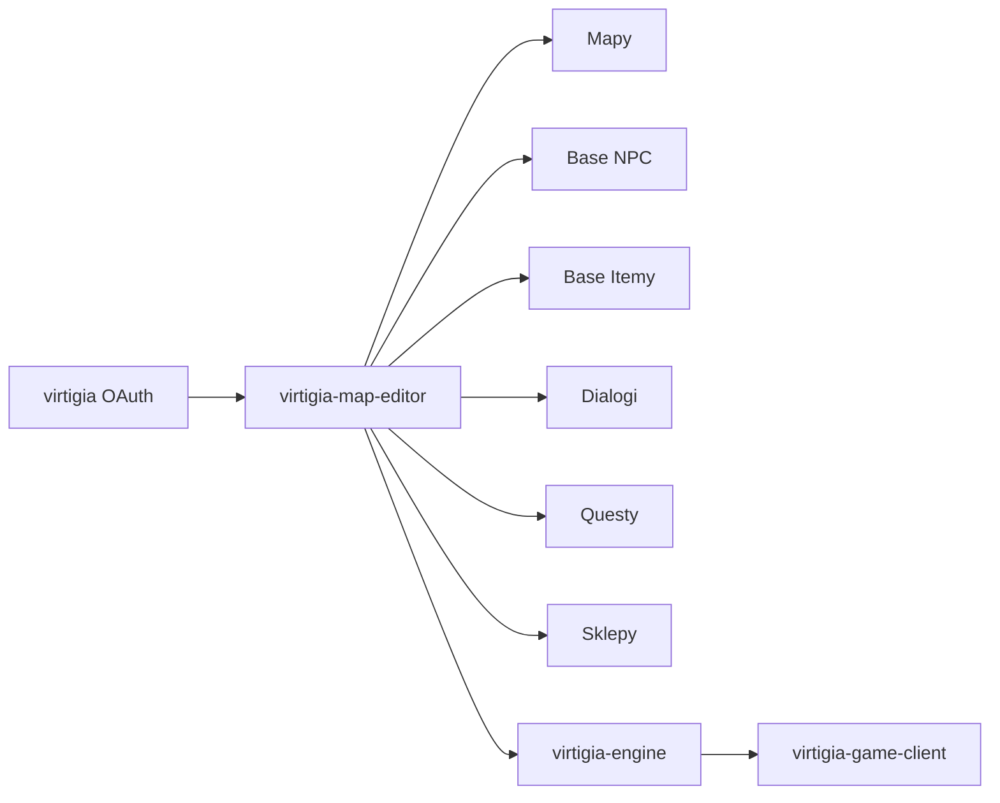

# Virtigia Map Editor

Edytor świata gry Virtigia: panel do budowania map, NPC, mobów, przedmiotów, sklepów, hoteli, questów, dialogów, eventów sezonowych i danych pomocniczych używanych później przez silnik gry.

To repozytorium jest narzędziem produkcyjnym dla twórców zawartości. Najważniejszą wartością aplikacji nie jest samo CRUD, tylko możliwość projektowania kompletnego świata: od grafiki mapy, przez kolizje, po dialog NPC, który sprawdza questa, zabiera złoto, otwiera depozyt, wydaje przedmioty albo uruchamia walkę.

## Spis Treści

- [Rola Aplikacji](#rola-aplikacji)
- [Najważniejsze Moduły](#najważniejsze-moduły)
- [Mapy](#mapy)
- [NPC I Base NPC](#npc-i-base-npc)
- [Przedmioty](#przedmioty)
- [Dialogi](#dialogi)
- [Questy](#questy)
- [Sklepy I Hotele](#sklepy-i-hotele)
- [Eventy I Systemy Pomocnicze](#eventy-i-systemy-pomocnicze)
- [API](#api)
- [Technologie](#technologie)
- [Uruchomienie Lokalne](#uruchomienie-lokalne)
- [Powiązane Repozytoria](#powiązane-repozytoria)

## Rola Aplikacji

Map editor jest miejscem, w którym powstaje zawartość świata. Dane zapisane w tym panelu są później używane przez `virtigia-engine` i widoczne w `virtigia-game-client`.



## Najważniejsze Moduły

| Moduł | Co oferuje |
| --- | --- |
| Dashboard | szybki start po wybraniu świata |
| Mapy | grafika mapy, kolizje, woda, PVP, przejścia, respawn, podgląd NPC |
| Mapa świata | minimapa, węzły świata, regenerowanie mapy świata |
| Base NPC | definicje mobów i NPC, grafiki, looty, rangi, gatunki, ataki specjalne |
| Rozmieszczone NPC | konkretne instancje NPC na mapach, lokacje, grupy i statusy |
| Base itemy | pełny edytor przedmiotów, statystyk, tagów, limitów i akcji |
| Dialogi NPC | edytor grafowy dialogów, reguły, akcje, sklepy, hotele, questy |
| Questy | questy, kroki, automatyczny postęp, widoczność i powiązania z dialogami |
| Sklepy | asortyment, ceny, wiązanie przedmiotów po zakupie |
| Hotele | pokoje, klucze, wynajem i konfiguracja |
| Książki | treści książek z podglądem przedmiotów i NPC |
| Pliki audio | dźwięki używane w grze |
| Drzwi | przejścia między mapami, wymagany poziom, wymagany przedmiot |
| Punkty startowe | startowe pozycje profesji |
| Miejsca odrodzenia | respawn gracza |
| Odnawialne przedmioty | przedmioty pojawiające się cyklicznie na mapach |
| Kalendarz nagród | dni kalendarza i przypisane nagrody |
| Gatunki mobów | grupowanie base NPC według gatunków |
| Ciosy specjalne | definicje ataków specjalnych i przypisania do base NPC |
| Liczniki dialogowe | zmienne sterujące dialogami |
| Wydarzenia sezonowe | warunkowe treści aktywne w określonych eventach |
| Generator dla forum | generowanie prezentacji NPC na forum |
| Batchy | podgląd batchy i zadań asynchronicznych |
| Logi zmian | logi aktywności użytkowników |
| API tokeny | tokeny do API edytora |
| Swagger API | dokumentacja API |
| Problemy z assetami | diagnostyka brakujących lub błędnych grafik |

## Mapy

Mapy są rdzeniem edytora. Każda mapa może mieć własną grafikę, kolizje, wodę, przejścia, właściwości PVP i powiązania z NPC.

### Tworzenie I Zarządzanie

- Tworzenie map.
- Edycja nazwy.
- Wgrywanie grafiki mapy.
- Kopiowanie mapy.
- Usuwanie mapy.
- Wyszukiwarka map.
- Pobieranie danych mapy dla podglądu.
- Przełączanie świata roboczego.

### Warstwy I Flagi

- Edycja kolizji.
- Czyszczenie kolizji.
- Edycja pól wody.
- Czyszczenie wody.
- Flaga PVP.
- Flaga battleground.
- Druga flaga battleground.
- Blokada teleportacji na mapę.
- Przypisanie miejsca odrodzenia.

### Podgląd Mapy

Widok `/maps/{mapId}` pozwala oglądać mapę z umieszczonymi NPC i elementami świata. Z poziomu podglądu można pracować z NPC, lokalizacjami i dodatkowymi ustawieniami mapy.

### Mapa Świata

- Widok minimapy świata.
- Regenerowanie minimapy.
- Węzły mapy świata.
- Dodawanie węzłów.
- Przesuwanie węzłów.
- Usuwanie węzłów.

### Drzwi I Przejścia

- Dodawanie drzwi na mapie.
- Lista drzwi dla mapy.
- Przesuwanie drzwi.
- Usuwanie drzwi.
- Wymagany poziom przejścia.
- Wymagany przedmiot przejścia.
- Zbiorcza aktualizacja ograniczeń poziomowych.
- Widok przejść na tytanów.

### Punkty Startowe I Respawn

- Miejsca odrodzenia gracza.
- Punkty startowe profesji.
- Automatyczne ustawianie domyślnych punktów startowych dla brakujących profesji.

## NPC I Base NPC

W edytorze są dwa poziomy NPC:

- `Base NPC` opisuje typ postaci lub moba: grafika, statystyki, loot, ranga, gatunki, ataki, offset rysowania.
- `NPC` opisuje konkretną instancję na mapie: lokacje, status, dialog, grupa, położenie.

### Base NPC

Base NPC obsługuje:

- Tworzenie proste i zaawansowane.
- Edycję danych bazowych.
- Wgrywanie grafiki.
- Offset rysowania grafiki w osi X i Y.
- Kategorie: NPC albo MOB.
- Rangi: normalny, elita, elita II, elita III, heros, tytan.
- Poziom.
- Profesję.
- Statystyki bojowe.
- Loot.
- Loot gwarantowany.
- Kopiowanie lootów z innego base NPC.
- Przypisywanie do gatunków mobów.
- Przypisywanie do wydarzeń sezonowych.
- Ataki specjalne.
- Transfer istniejących NPC do innego base NPC.
- Konwersję base NPC do warstwy i cofanie tej konwersji.
- Wyszukiwarkę zwykłą i wyszukiwarkę herosów.
- Generator opisu na forum.

### Rozmieszczone NPC

NPC na mapach obsługują:

- Tworzenie instancji.
- Edycję.
- Włączanie i wyłączanie.
- Dodawanie lokacji.
- Edycję lokacji.
- Usuwanie lokacji.
- Podpinanie dialogu.
- Tworzenie dialogu i od razu przypisanie do NPC.
- Grupowanie NPC.
- Dodawanie NPC do grupy.
- Tworzenie grupy.
- Wykluczanie z grupy.
- Podgląd szczegółów.
- Wyszukiwanie herosów.

### Gatunki Mobów

- Tworzenie gatunków.
- Wyszukiwanie gatunków.
- Podgląd gatunku.
- Podpinanie base NPC do gatunku.
- Odłączanie base NPC od gatunku.

### Ciosy Specjalne

- Tworzenie ciosów specjalnych.
- Edycja.
- Usuwanie.
- Podgląd.
- Wyszukiwanie po API.
- Przypisywanie do base NPC.
- Odłączanie od base NPC.

## Przedmioty

Base itemy opisują wszystkie przedmioty używane przez silnik gry: broń, pancerze, konsumpcyjne, torby, sakwy, strzały, książki, klucze, talizmany, błogosławieństwa i wiele innych.

### Kategorie Przedmiotów

| Kategoria | Przeznaczenie |
| --- | --- |
| `oneHanded` | broń jednoręczna |
| `twoHanded` | broń dwuręczna |
| `halfHanded` | broń półtoraręczna |
| `staffs` | kostury |
| `wands` | różdżki |
| `distances` | broń dystansowa |
| `arrows` | strzały |
| `armors` | pancerze |
| `helmets` | hełmy |
| `gloves` | rękawice |
| `boots` | buty |
| `shields` | tarcze |
| `rings` | pierścienie |
| `necklaces` | naszyjniki |
| `auxiliary` | przedmioty pomocnicze |
| `quests` | przedmioty questowe |
| `consumable` | przedmioty konsumpcyjne |
| `neutrals` | przedmioty neutralne |
| `backpacks` | torby |
| `pouches` | sakwy |
| `talismans` | talizmany |
| `upgrades` | ulepszacze |
| `books` | książki |
| `musicBoxes` | pozytywki |
| `keys` | klucze |
| `golds` | złoto |
| `blessings` | błogosławieństwa |
| `pets` | zwierzaki |

### Rzadkości

- Zwykły.
- Unikatowy.
- Heroiczny.
- Legendarny.
- Ulepszony.
- Artefakt.

### Waluty

- Złoto.
- Łzy smoka.
- Honor.
- Brak waluty.

### Operacje Na Przedmiotach

- Tworzenie.
- Kopiowanie.
- Edycja.
- Usuwanie.
- Wgrywanie grafiki.
- Wgrywanie grafiki peta.
- Wyszukiwanie.
- Podgląd.
- Edycja atrybutów.
- Skalowanie atrybutów przez API.
- Wyliczanie punktów atrybutów.

### Atrybuty Akcji

Przedmiot może wykonywać akcje po użyciu albo wpływać na zachowanie interfejsu:

- Teleportacja.
- Leczenie.
- Przywracanie procentu zdrowia.
- Dodawanie złota.
- Dodawanie drakonitu.
- Zmiana staminy.
- Skracanie nieprzytomności.
- Ucieczka z walki.
- Otwieranie depozytu.
- Otwieranie depozytu klanowego.
- Otwieranie poczty.
- Otwieranie aukcji.
- Lokalizowanie herosa.
- Dokładne lokalizowanie herosa.
- Użycie outfitu.
- Użycie peta.
- Otwarcie książki.
- Rozwiązywanie przypisania właściciela.
- Rozwiązywanie trwałego przypisania.

### Atrybuty Bojowe I Statystyki

Edytor pozwala opisywać przedmioty przez statystyki i bonusy:

- Siła.
- Intelekt.
- Zręczność.
- Zdrowie.
- Mana.
- Energia.
- Pancerz.
- Blok.
- Unik.
- Szybkość ataku.
- Szansa krytyczna.
- Moc krytyczna fizyczna i magiczna.
- Przebicie pancerza.
- Absorpcja obrażeń fizycznych i magicznych.
- Redukcje i odporności.
- Obrażenia fizyczne.
- Obrażenia od trucizny.
- Obrażenia od ognia.
- Obrażenia od lodu.
- Obrażenia od światła.
- Obrażenia strzał.
- Szansa na kontrę.
- Szansa na głęboką ranę.
- Bonus do doświadczenia za walkę.
- Bonus szansy na łup heroiczny.
- Bonus szansy na łup legendarny.
- Minimalna szansa na niepusty łup.
- Szansa, że strzała nie zostanie zużyta.
- Leczenie po walce.
- Przyspieszone odzyskiwanie po nieprzytomności.

### Limity I Wymagania

- Wymagany poziom.
- Wymagana profesja.
- Wymagana siła.
- Wymagany intelekt.
- Wymagana zręczność.
- Czas odnowienia.
- Data wygaśnięcia.
- Limit map.
- Wymagany quest.

### Tagi I Blokady

- Przedmiot niezidentyfikowany.
- Przedmiot związany z właścicielem.
- Przedmiot trwale związany.
- Przedmiot wiąże się po założeniu.
- Przedmiot wiąże się po zakupie.
- Brak możliwości wystawienia na aukcji.
- Brak możliwości przechowania w depozycie.
- Brak możliwości przechowania w depozycie klanowym.
- Przedmiot odzyskany.
- Przedmiot niemożliwy do usunięcia.
- Czas do zniknięcia.

### Torby, Sakwy I Ilości

- Pojemność torby.
- Maksymalna ilość sztuk w stacku.
- Aktualna ilość sztuk.
- Kategorie możliwe do przechowywania.
- Obsługa strzał i stackowania zależnie od konfiguracji świata.

### Ulepszanie I Redukcje

- Procent ulepszenia dla przedmiotów zwykłych.
- Procent ulepszenia dla unikatów.
- Procent ulepszenia dla heroicznych.
- Procent ulepszenia dla legendarnych.
- Kategorie możliwe do ulepszenia.
- Redukcja wymaganego poziomu dla różnych rzadkości.

### Bonusy Legendarne

- Leczący dotyk.
- Super krytyk.
- Super redukcja magiczna.
- Super redukcja fizyczna.
- Super redukcja krytyczna.
- Klątwa po trafieniu.
- Odepchnięcie.
- Super leczenie przy niskim zdrowiu.

## Dialogi

Dialogi są najbardziej rozbudowanym modułem edytora. Są budowane jako graf węzłów, krawędzi i opcji, dzięki czemu jeden NPC może prowadzić prostą rozmowę, sklep, hotel, questa, walkę, event lub złożony scenariusz fabularny.

### Edytor Grafowy

- Lista dialogów.
- Tworzenie dialogu.
- Kopiowanie dialogu.
- Wyszukiwanie.
- Podgląd dialogu.
- Edycja nazwy i danych dialogu.
- Dodawanie węzłów.
- Import węzła z JSON.
- Kopiowanie węzła.
- Przesuwanie węzła.
- Usuwanie węzła.
- Dodawanie krawędzi.
- Usuwanie krawędzi.
- Edycja krawędzi startowych.
- Dodawanie opcji odpowiedzi.
- Zmiana kolejności opcji.
- Edycja opcji.
- Usuwanie opcji.

### Węzły Dialogu

Węzeł może:

- Wyświetlać treść rozmowy.
- Prowadzić do kolejnych węzłów.
- Uruchamiać akcję.
- Mieć przypisany sklep.
- Mieć przypisany hotel.
- Być częścią losowania albo startu rozmowy.

### Akcje Węzłów

Węzły obsługują akcje:

- Dodanie przedmiotów.
- Dodanie złota.
- Dodanie punktów honoru.
- Dodanie doświadczenia.
- Dodanie procentu doświadczenia.
- Ustawienie kroku questa.
- Rzucenie błogosławieństwa.
- Ustawienie outfitu.
- Dodanie licznika dialogowego.
- Zresetowanie licznika dialogowego.
- Zresetowanie dodatkowych punktów atrybutów.

### Reguły Opcji Dialogowych

Opcja dialogowa może być dostępna tylko wtedy, gdy gracz spełnia warunki:

- Ma odpowiednią ilość złota.
- Ma odpowiedni poziom.
- Jest członkiem Karmazynowego Bractwa.
- Posiada wymagane przedmioty.
- Przejdzie procentową szansę.
- Ma wymagany krok questa.
- Jest przed wymaganym krokiem questa.
- Jest po wymaganym kroku questa.
- Ma odpowiednią ilość łez smoka.
- Wpisał wymaganą treść wiadomości.
- Ma wymagany licznik dialogowy.
- Trwa wymagane wydarzenie sezonowe.

### Akcje Opcji Dialogowych

Kliknięcie opcji może:

- Uleczyć gracza.
- Zabić gracza.
- Odjąć doświadczenie.
- Uruchomić walkę.
- Zabić NPC i pokazać łup.
- Zabić NPC bez okna łupu.
- Otworzyć pocztę.
- Otworzyć depozyt.
- Otworzyć depozyt klanowy.
- Otworzyć aukcje.

### Dialogi A Questy

Dialog może:

- Wymagać konkretnego kroku questa.
- Przepuścić gracza tylko przed albo po konkretnym kroku.
- Ustawić krok questa.
- Wpływać na automatyczny postęp questa.
- Pokazywać inne opcje zależnie od postępu.
- Używać liczników dialogowych jako dodatkowego stanu.

### Dialogi A Ekonomia

Dialog może:

- Wymagać złota.
- Opcjonalnie konsumować złoto.
- Wymagać łez smoka.
- Dodawać złoto.
- Dodawać honor.
- Dodawać doświadczenie.
- Dodawać przedmioty.

### Dialogi A Usługi

Dialog może działać jak bramka do innych systemów:

- Sklep.
- Hotel.
- Aukcje.
- Depozyt.
- Depozyt klanowy.
- Poczta.
- Walka.
- Okno łupów.
- Błogosławieństwo.

## Questy

Questy są powiązane z dialogami, NPC i automatycznym postępem.

### Quest

- Tworzenie.
- Edycja.
- Usuwanie.
- Wyszukiwanie.
- Podgląd.
- Lista kroków.

### Kroki Questa

Kroki obsługują:

- Nazwę.
- Opis.
- Widoczność na liście questów.
- Automatyczny postęp następnego dnia.
- Automatyczne przejście do innego kroku.
- Powiązania z dialogami.
- Powiązania z NPC.
- Powiązania z mobami i gatunkami.

## Sklepy I Hotele

### Sklepy

- Tworzenie sklepów.
- Wyszukiwanie.
- Podgląd.
- Edycja.
- Dodawanie przedmiotów.
- Usuwanie przedmiotów.
- Konfiguracja, czy przedmioty wiążą się trwale po zakupie.

### Hotele

- Tworzenie hoteli.
- Wyszukiwanie.
- Podgląd.
- Edycja.
- Usuwanie.
- Dodawanie pokojów.
- Edycja pokojów.
- Usuwanie pokojów.
- Powiązanie z dialogiem NPC.

## Eventy I Systemy Pomocnicze

### Wydarzenia Sezonowe

- CRUD wydarzeń sezonowych.
- API JSON dla edytora dialogów.
- Powiązanie base NPC z wydarzeniami.
- Reguły dialogowe zależne od eventu.

### Liczniki Dialogowe

- CRUD liczników.
- API JSON dla dialogów.
- Inkrementacja i reset z poziomu dialogu.
- Warunkowanie opcji dialogowej stanem licznika.

### Kalendarz Nagród

- Dni kalendarza.
- Przypisane przedmioty.
- Usuwanie nagród.
- Usuwanie dni.

### Książki

- CRUD książek.
- Pobieranie treści.
- Podgląd base NPC.
- Podgląd base itemów.
- Możliwość otwierania książek przez przedmioty w grze.

### Audio

- CRUD plików audio.
- Wyszukiwarka.
- Pobieranie pliku.
- Dane wykorzystywane przez klienta gry.

### Odnawialne Przedmioty

- Lista odnawialnych przedmiotów.
- Dodawanie odnawialnego przedmiotu do mapy.
- Usuwanie odnawialnego przedmiotu z mapy.
- Dane używane przez silnik do cyklicznego odradzania przedmiotów.

### Informacje O Świecie

- Podgląd danych świata.
- Zbiorcza operacja na loocie gwarantowanym base NPC.
- Podgląd zmian przed zastosowaniem.
- Zastosowanie zmian.

### Diagnostyka

- Logi aktywności.
- Użytkownicy.
- Problemy z assetami.
- Batchy.
- Debug statystyk postaci i base NPC.

## API

Edytor wystawia API `v1` zabezpieczone tokenem:

| Endpoint | Zastosowanie |
| --- | --- |
| `GET /api/v1/profile` | profil tokenu |
| `GET /api/v1/quests` | lista questów |
| `GET /api/v1/maps` | lista map |
| `GET /api/v1/maps/{mapId}` | szczegóły mapy |
| `PATCH /api/v1/maps/{mapId}` | aktualizacja mapy |
| `GET /api/v1/base-npcs` | lista base NPC |
| `GET /api/v1/base-npcs/{baseNpcId}` | szczegóły base NPC |
| `GET /api/v1/npcs` | lista NPC |
| `GET /api/v1/npcs/{npcId}` | szczegóły NPC |
| `POST /api/v1/npcs` | utworzenie NPC |
| `PATCH /api/v1/npcs/{npcId}` | aktualizacja NPC |
| `DELETE /api/v1/npcs/{npcId}` | usunięcie NPC |
| `GET /api/v1/npcs/{npcId}/locations` | lokacje NPC |
| `POST /api/v1/npcs/{npcId}/locations` | dodanie lokacji NPC |
| `DELETE /api/v1/npcs/{npcId}/locations/{locationId}` | usunięcie lokacji NPC |
| `GET /api/v1/dialogs` | lista dialogów |
| `GET /api/v1/dialogs/{dialogId}` | szczegóły dialogu |

Są też endpointy webowe dla zalogowanego użytkownika:

- skalowanie atrybutów przedmiotów,
- wyliczanie punktów atrybutów,
- wyszukiwarki base NPC, base itemów, audio, assetów i ciosów specjalnych.

## Technologie

- Laravel 11.
- PHP 8.2.
- Inertia.
- Vue 3.
- PrimeVue.
- Vite.
- Pinia.
- Vue Flow.
- Tailwind CSS.
- Laravel Scout.
- Meilisearch.
- Laravel Horizon.
- Laravel Telescope.
- Laravel Passport OAuth przez stronę główną.
- S3 / signed URLs dla assetów.
- Swagger / OpenAPI.
- `virtigia-tips` z GitHuba.

## Uruchomienie Lokalne

```bash
composer install
npm install
cp .env.example .env
php artisan key:generate
php artisan migrate
npm run dev
php artisan serve
```

Pełny tryb developerski z serwerem, Horizonem, logami i Vite:

```bash
composer dev
```

Build frontendu:

```bash
npm run build
```

## Powiązane Repozytoria

| Repozytorium | Rola |
| --- | --- |
| `virtigia` | strona główna, OAuth, konta, forum i uprawnienia |
| `virtigia-engine` | silnik zużywający dane stworzone w edytorze |
| `virtigia-game-client` | klient gry pokazujący mapy, NPC, dialogi i przedmioty |
| `virtigia-world-admin` | panel administracyjny danych działającego świata |
| `virtigia-tips` | tooltipy przedmiotów, NPC, petów i postaci |
| `virtigia-assets` | grafiki i zasoby gry |
